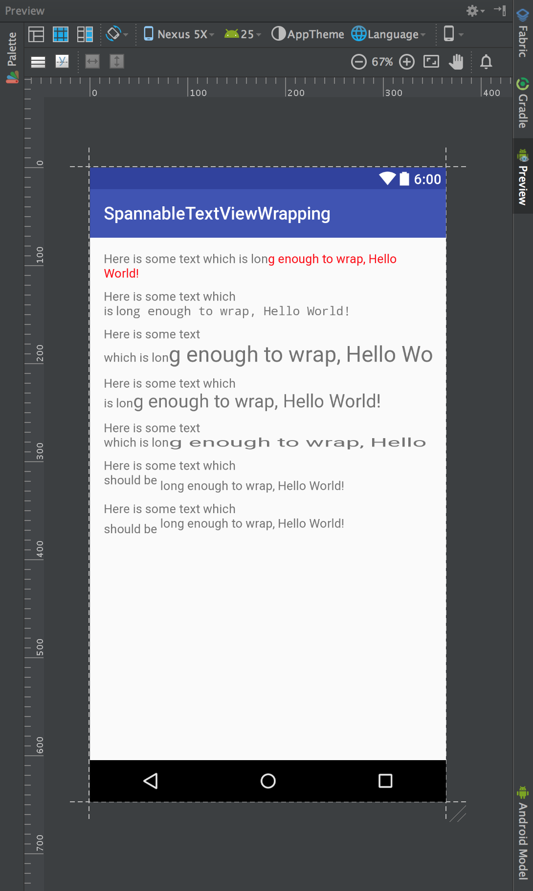
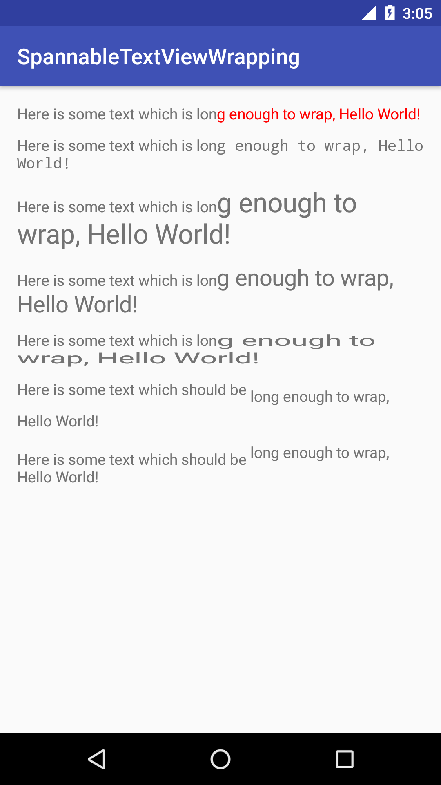

# MetricAffectingSpan Android Studio Preview Bug

This project implements a reproducable case for a bug report I created for Android Studio. 

## Expected Behavior:

Andriod studio renders a custom textview which adds MetricAffectingSpans to the text it is given via `setText(CharSequence, BufferType)` with correct wrapping and no clipping/truncating.

## Actual Behavior:

Andriod Studio's layout preview incorrectly inserts line breaks into the text when rendering the custom text views.

## Screenshots:

These screenshots show several instances of `MyTextView`:

1. Half the text is rendered with a `ForegroundColorSpan` (non-metric affecting, works fine in the android studio preview.
1. Half the text with a monospace `TypefaceSpan` (metric affecting, incorrect in preview)
1. Half the text with an `AbsoluteSizeSpan` (metric affecting, incorrect in preview)
1. Half the text with a `RelativeSizeSpan` (metric affecting, incorrect in preview)
1. Half the text with a `ScaleXSpan` (metric affecting, incorrect in preview)
1. Half the text with a `SubscriptSpan` (metric affecting, incorrect in preview)
1. Half the text with a `SuperscriptSpan` (metric affecting, incorrect in preview)

### Android Studio Preview

### Device Screenshot

